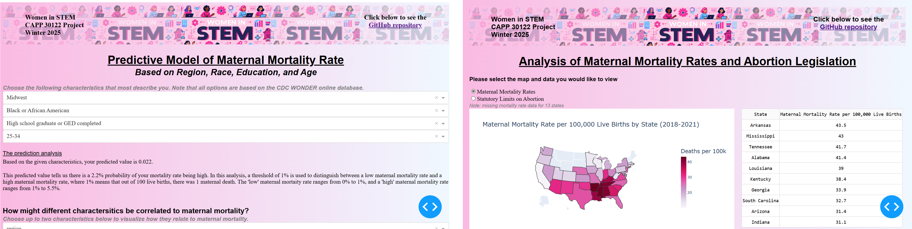

# States of Care: Investigating U.S. Maternal Mortality

### Team Members: 
- [Elizabeth Ronan](https://github.com/elizabethronan)
- [Dorothy Wongkarnta](https://github.com/Donlapun)
- [Madelin De Jesus Martinez](https://github.com/madelindejesus)
- [Alexandrea Harriott](https://github.com/a-harriott)

### Abstract

This project investigates maternal mortality across the United States, producing key insights of maternal mortality risk at an individual-level, and examining its correlation with state-specific characteristics. This project has two components. The first is a python program that utilizes regression analysis to look at the association between someone’s region, race, age, and education level and their maternal mortality risk. Along with this, the user can explore other combinations of these factors to compare their own risk with another group’s. The second component is data visualization of state-level summary statistics of characteristics that may impact maternal mortality, like abortion policies, insurance coverage, demographic factors, and insurance coverage. By analyzing individual-level factors, possible patterns and disparities in maternal health outcomes can be drawn from analysis output, and at the state-level, the influence of policy decisions and the social determinants of health can be better understood.

As a note, our datasets include information on those identified as women. We recognize that this analysis extends to anyone assigned female at birth, including trans men and nonbinary people who experience pregnancy. Additionally, our analysis was constrained by the limitations inherent in the dataset used, particularly the underrepresentation of certain racial groups, such as individuals of Asian descent. This disparity in demographic observations may affect the generalizability of our findings across diverse populations.

### How to Run the Appplication

1. Clone the repository using this command: 

`git clone git@github.com:uchicago-2025-capp30122/30122-project-women-in-stem.git`

or 

`git clone https://github.com/uchicago-2025-capp30122/30122-project-women-in-stem.git`

2. Go into the repository, downlaod necessary pacakges for running the program:

`cd 30122-project-women-in-stem`

`uv sync`

3. Run the scrapers to get the data (optional): 

`uv run python -m mortality scrape`

4. To execute the program choose one of the following:

`uv run python -m mortality map` - to run the visualization map

`uv run python -m mortality prediction` - to run the predictive model

Please follow the prompts once the program starts.

### Data Sources
- [CDC Wonder](https://wonder.cdc.gov/)
- [Kaiser Family Foundation](https://www.kff.org/interactive/womens-health-profiles/united-states/maternal-infant-health/)

For both of these sources, the necessary data has been loaded into the program for you already. There are no extra steps necessary in order to use the program.
